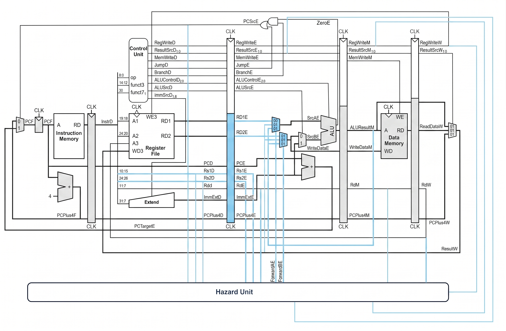

# RISC-V_pipelined

# RISC-V Pipeline — Bản tổng hợp đã chỉnh sửa

> Tài liệu này là bản tra cứu duy nhất cho bộ mã RISC-V pipeline trong `risc-v.zip`.
> Bản gốc được giữ nguyên; toàn bộ mã bên dưới là bản đã chỉnh sửa.



## 1. Mục lục nhanh

- [Phạm vi thiết kế](#2-phạm-vi-thiết-kế)
- [Các lỗi đã chỉnh sửa](#3-các-lỗi-đã-chỉnh-sửa)
- [Quy ước tín hiệu](#4-quy-ước-tín-hiệu)
- [Kết quả mong đợi của testbench](#5-kết-quả-mong-đợi-của-testbench)
- [ModelSim/Questa](#6-mô-phỏng-modelsimquesta)
- [Toàn bộ mã nguồn đã sửa](#7-toàn-bộ-mã-nguồn-đã-sửa)
- [Các việc còn cần làm nếu mở rộng thành RV32I](#8-các-việc-còn-cần-làm-nếu-mở-rv32i)

## 2. Phạm vi thiết kế

Bản hiện tại hỗ trợ các nhóm lệnh:

| Nhóm | Lệnh |
|---|---|
| R-type | `add`, `sub`, `and`, `or`, `slt` |
| I-type | `addi`, `lw` |
| S-type | `sw` |
| B-type | `beq` |

Đây là bộ xử lý pipeline 5 tầng IF–ID–EX–MEM–WB dùng cho kiểm chứng datapath, forwarding, load-use stall và branch flush. Không được mô tả là bộ xử lý RV32I đầy đủ vì hiện chưa có `jal`, `jalr`, các nhánh khác, byte/halfword access, CSR, exception và interrupt.

## 3. Các lỗi đã chỉnh sửa

| Mã | Vấn đề trong bản gốc | Cách chỉnh |
|---|---|---|
| FIX-01 | `ImmSrc`, `ResultSrc`, `ALUControl` có độ rộng nhỏ và không thống nhất | Chuẩn hóa thành lần lượt 3 bit, 3 bit và 4 bit |
| FIX-02 | `Control_Unit` có cổng `Zero` và `PCSrc` thừa, dễ gây nhầm control/data | Bỏ hai cổng này; `PCSrcE` tạo ở tầng EX từ `BranchE && ZeroE` |
| FIX-03 | B-type immediate sign-extension dùng 20 bit nên tổng độ rộng bị sai | Dùng sign-extension 19 bit cho immediate 13 bit |
| FIX-04 | `SLT` so sánh unsigned | Dùng so sánh signed theo RV32I |
| FIX-05 | Forwarding từ MEM luôn lấy `ALUResultM` | Nếu là `lw`, forwarding lấy `ReadDataM`; nếu không lấy `ALUResultM` |
| FIX-06 | Load-use stall có thể so sánh nhầm các trường immediate với `rdE` | Thêm `UsesRs1D`, `UsesRs2D` và chặn `rdE == x0` |
| FIX-07 | Register file cho phép ghi vào x0 | Chặn mọi lệnh ghi có `write_addr == 0` |
| FIX-08 | Data memory không kiểm tra giới hạn địa chỉ | Địa chỉ ngoài vùng 64 word trả về 0 và không ghi |
| FIX-09 | Instruction memory không khởi tạo phần còn lại | Khởi tạo tất cả ô bằng NOP `addi x0,x0,0` |
| FIX-10 | Tên reset không thể hiện active-low | Đổi thành `reset_n` và ghi rõ trong testbench |
| FIX-11 | Testbench chỉ chạy rồi dừng, không kết luận đúng/sai | Thêm VCD waveform và kiểm tra PASS/FAIL tự động |
| FIX-12 | Chưa có kiểm tra branch flush | Testbench xác nhận `x6 == 0`, chứng minh lệnh ở địa chỉ 0x1C bị flush |

## 4. Quy ước tín hiệu

### 4.1. ResultSrc

| Giá trị | Ý nghĩa |
|---|---|
| `3'b000` | Kết quả ALU |
| `3'b001` | Dữ liệu đọc từ memory |
| `3'b010` | PC + 4 |

### 4.2. ImmSrc

| Giá trị | Kiểu immediate |
|---|---|
| `3'b000` | I-type |
| `3'b001` | S-type |
| `3'b010` | B-type |

### 4.3. ALUControl

| Giá trị | Phép toán |
|---|---|
| `4'b0000` | ADD |
| `4'b0001` | SUB |
| `4'b0010` | AND |
| `4'b0011` | OR |
| `4'b0101` | SLT signed |

### 4.4. Forwarding

| Forward | Nguồn |
|---|---|
| `2'b00` | Giá trị đọc từ register file ở EX |
| `2'b01` | Kết quả WB |
| `2'b10` | Kết quả MEM hoặc dữ liệu load từ MEM |

Branch `beq` dùng các toán hạng đã forwarding tại EX; vì vậy phụ thuộc dữ liệu của branch được kiểm tra trong cùng testbench.

## 5. Kết quả mong đợi của testbench

Chương trình mẫu trong `Instruction_Memory.v` phải tạo ra:

| Đối tượng | Giá trị mong đợi | Ý nghĩa |
|---|---:|---|
| x1 | 5 | ADDI |
| x2 | 10 | ADDI |
| x3 | 15 | ADD + forwarding |
| RAM[1] | 15 | SW |
| x4 | 15 | LW |
| x5 | 10 | SUB sau load-use stall |
| x6 | 0 | ADDI tại 0x1C bị branch flush |
| x7 | 11 | Lệnh tại branch target 0x20 |

Nếu tất cả điều kiện đúng, console in:

```
PASS: forwarding, load-use stall, branch flush, and write-back checks passed.
```

## 6. Mô phỏng ModelSim/Questa

Trong thư mục chứa các file Verilog đã sửa:

```tcl
vlib work
vlog *.v
vsim -voptargs=+acc Pipelined_RISCV_tb
add wave -divider {Clock and Control}
add wave sim:/Pipelined_RISCV_tb/clk
add wave sim:/Pipelined_RISCV_tb/reset_n
add wave sim:/Pipelined_RISCV_tb/uut/PCF
add wave sim:/Pipelined_RISCV_tb/uut/InstrD
add wave sim:/Pipelined_RISCV_tb/uut/ForwardAE
add wave sim:/Pipelined_RISCV_tb/uut/ForwardBE
add wave sim:/Pipelined_RISCV_tb/uut/StallD
add wave sim:/Pipelined_RISCV_tb/uut/FlushE
add wave -divider {Datapath}
add wave sim:/Pipelined_RISCV_tb/uut/SrcAE
add wave sim:/Pipelined_RISCV_tb/uut/SrcBE
add wave sim:/Pipelined_RISCV_tb/uut/ALUResultE
add wave sim:/Pipelined_RISCV_tb/uut/ALUResultM
add wave sim:/Pipelined_RISCV_tb/uut/ReadDataM
add wave sim:/Pipelined_RISCV_tb/uut/ResultW
add wave -divider {Register File}
add wave sim:/Pipelined_RISCV_tb/uut/RegFiles/Regfile
run 350 ns
```

Chạy bằng file DO:

```tcl
vlib work
vlog *.v
vsim -voptargs=+acc Pipelined_RISCV_tb
do wave.do
run 350 ns
```

Các đoạn waveform cần chụp:

1. `ForwardAE` hoặc `ForwardBE` đổi sang `2'b10` khi xử lý phụ thuộc dữ liệu.
2. `StallD = 1` trong load-use hazard.
3. `FlushE = 1` khi branch được quyết định.
4. `PCF` chuyển tới địa chỉ branch target 0x20.
5. `x6` không được ghi giá trị 99.

## 7. Toàn bộ mã nguồn đã sửa

## Control_Unit.v

```verilog
module Control_Unit (
    input  [6:0] op,
    input  [2:0] funct3,
    input        funct7_5,
    output reg       RegWrite,
    output reg       ALUSrc,
    output reg       MemWrite,
    output reg [2:0] ImmSrc,
    output reg [2:0] ResultSrc,
    output reg [3:0] ALUControl,
    output reg       Branch
);
    localparam IMM_I = 3'b000;
    localparam IMM_S = 3'b001;
    localparam IMM_B = 3'b010;

    localparam RES_ALU = 3'b000;
    localparam RES_MEM = 3'b001;
    localparam RES_PC4 = 3'b010;

    localparam ALU_ADD = 4'b0000;
    localparam ALU_SUB = 4'b0001;
    localparam ALU_AND = 4'b0010;
    localparam ALU_OR  = 4'b0011;
    localparam ALU_SLT = 4'b0101;

    always @(*) begin
        RegWrite   = 1'b0;
        ALUSrc     = 1'b0;
        MemWrite   = 1'b0;
        ImmSrc     = IMM_I;
        ResultSrc  = RES_ALU;
        ALUControl = ALU_ADD;
        Branch     = 1'b0;

        case (op)
            7'b0000011: begin // LW
                RegWrite   = 1'b1;
                ALUSrc     = 1'b1;
                ImmSrc     = IMM_I;
                ResultSrc  = RES_MEM;
                ALUControl = ALU_ADD;
            end

            7'b0100011: begin // SW
                ALUSrc     = 1'b1;
                MemWrite   = 1'b1;
                ImmSrc     = IMM_S;
                ALUControl = ALU_ADD;
            end

            7'b0110011: begin // R-type: ADD, SUB, AND, OR, SLT
                RegWrite = 1'b1;
                case (funct3)
                    3'b000: ALUControl = funct7_5 ? ALU_SUB : ALU_ADD;
                    3'b111: ALUControl = ALU_AND;
                    3'b110: ALUControl = ALU_OR;
                    3'b010: ALUControl = ALU_SLT;
                    default: begin RegWrite = 1'b0; ALUControl = ALU_ADD; end
                endcase
            end

            7'b0010011: begin // ADDI
                RegWrite   = (funct3 == 3'b000);
                ALUSrc     = 1'b1;
                ImmSrc     = IMM_I;
                ALUControl = ALU_ADD;
            end

            7'b1100011: begin // BEQ
                Branch     = (funct3 == 3'b000);
                ImmSrc     = IMM_B;
                ALUControl = ALU_SUB;
            end

            default: begin
                // Inert control values represent a pipeline bubble/NOP.
            end
        endcase
    end
endmodule

```

## Extend.v

```verilog
module Extend (
    input  [2:0]  ImmSrc,
    input  [24:0] Imm,
    output reg [31:0] ImmExt
);
    always @(*) begin
        case (ImmSrc)
            3'b000: ImmExt = {{20{Imm[24]}}, Imm[24:13]};
            3'b001: ImmExt = {{20{Imm[24]}}, Imm[24:18], Imm[4:0]};
            // B-immediate is 13 bits: imm[12|10:5|4:1|0].
            3'b010: ImmExt = {{19{Imm[24]}}, Imm[24], Imm[0], Imm[23:18], Imm[4:1], 1'b0};
            default: ImmExt = 32'd0;
        endcase
    end
endmodule

```

## alu.v

```verilog
module alu (
    input  [3:0]  alu_op,
    input  [31:0] src_a,
    input  [31:0] src_b,
    output reg [31:0] alu_result,
    output Zero
);
    localparam ALU_ADD = 4'b0000;
    localparam ALU_SUB = 4'b0001;
    localparam ALU_AND = 4'b0010;
    localparam ALU_OR  = 4'b0011;
    localparam ALU_SLT = 4'b0101;

    assign Zero = (alu_result == 32'd0);

    always @(*) begin
        case (alu_op)
            ALU_ADD: alu_result = src_a + src_b;
            ALU_SUB: alu_result = src_a - src_b;
            ALU_AND: alu_result = src_a & src_b;
            ALU_OR : alu_result = src_a | src_b;
            // RV32I SLT is a signed comparison.
            ALU_SLT: alu_result = ($signed(src_a) < $signed(src_b)) ? 32'd1 : 32'd0;
            default: alu_result = 32'd0;
        endcase
    end
endmodule

```

## Hazard_Unit.v

```verilog
module Hazard_Unit (
    input  [4:0] rs1D,
    input  [4:0] rs2D,
    input  [4:0] rs1E,
    input  [4:0] rs2E,
    input  [4:0] rdE,
    input  [4:0] rdM,
    input  [4:0] rdW,
    input        RegWriteM,
    input        RegWriteW,
    input        MemToRegE,
    input        PCSrcE,
    input        UsesRs1D,
    input        UsesRs2D,
    output reg [1:0] ForwardAE,
    output reg [1:0] ForwardBE,
    output StallF,
    output StallD,
    output FlushE,
    output FlushD
);
    wire load_use_stall;

    always @(*) begin
        ForwardAE = 2'b00;
        ForwardBE = 2'b00;

        if (RegWriteM && (rdM != 5'd0) && (rs1E == rdM))
            ForwardAE = 2'b10;
        if (RegWriteM && (rdM != 5'd0) && (rs2E == rdM))
            ForwardBE = 2'b10;

        if (RegWriteW && (rdW != 5'd0) && (rs1E == rdW) &&
            !(RegWriteM && (rdM != 5'd0) && (rs1E == rdM)))
            ForwardAE = 2'b01;
        if (RegWriteW && (rdW != 5'd0) && (rs2E == rdW) &&
            !(RegWriteM && (rdM != 5'd0) && (rs2E == rdM)))
            ForwardBE = 2'b01;
    end

    assign load_use_stall = MemToRegE && (rdE != 5'd0) &&
                            ((UsesRs1D && (rs1D == rdE)) ||
                             (UsesRs2D && (rs2D == rdE)));

    assign StallF = load_use_stall;
    assign StallD = load_use_stall;
    assign FlushD = PCSrcE;
    assign FlushE = load_use_stall || PCSrcE;
endmodule

```

## Instruction_Memory.v

```verilog
module Instruction_Memory (
    input  [31:0] read_address,
    output [31:0] instruction
);
    reg [31:0] Imemory [0:63];
    integer i;

    assign instruction = (read_address[31:8] == 24'd0)
                       ? Imemory[read_address[31:2]]
                       : 32'h00000013; // ADDI x0, x0, 0 (NOP)

    initial begin
        for (i = 0; i < 64; i = i + 1)
            Imemory[i] = 32'h00000013;

        Imemory[0] = 32'h00500093; // 0x00: addi x1, x0, 5
        Imemory[1] = 32'h00a00113; // 0x04: addi x2, x0, 10
        Imemory[2] = 32'h002081b3; // 0x08: add  x3, x1, x2
        Imemory[3] = 32'h00302223; // 0x0C: sw   x3, 4(x0)
        Imemory[4] = 32'h00402203; // 0x10: lw   x4, 4(x0)
        Imemory[5] = 32'h401202b3; // 0x14: sub  x5, x4, x1
        Imemory[6] = 32'h00228463; // 0x18: beq  x5, x2, +8
        Imemory[7] = 32'h06300313; // 0x1C: addi x6, x0, 99 (must flush)
        Imemory[8] = 32'h00128393; // 0x20: addi x7, x5, 1
    end
endmodule

```

## Data_Memory.v

```verilog
module Data_Memory (
    input clk,
    input MemWrite,
    input [31:0] addr,
    input [31:0] write_data,
    output [31:0] read_data
);
    reg [31:0] RAM [0:63];
    integer i;
    wire valid_addr = (addr[31:8] == 24'd0);

    initial begin
        for (i = 0; i < 64; i = i + 1)
            RAM[i] = 32'd0;
    end

    assign read_data = valid_addr ? RAM[addr[31:2]] : 32'd0;

    always @(posedge clk) begin
        if (MemWrite && valid_addr)
            RAM[addr[31:2]] <= write_data;
    end
endmodule

```

## Register_File.v

```verilog
module Register_File (
    input clk,
    input RegWrite,
    input [4:0] read_addr_1,
    input [4:0] read_addr_2,
    input [4:0] write_addr,
    input [31:0] write_data,
    output [31:0] read_data_1,
    output [31:0] read_data_2
);
    reg [31:0] Regfile [0:31];
    integer k;

    initial begin
        for (k = 0; k < 32; k = k + 1)
            Regfile[k] = 32'd0;
    end

    assign read_data_1 = (read_addr_1 == 5'd0) ? 32'd0 : Regfile[read_addr_1];
    assign read_data_2 = (read_addr_2 == 5'd0) ? 32'd0 : Regfile[read_addr_2];

    always @(posedge clk) begin
        if (RegWrite && (write_addr != 5'd0))
            Regfile[write_addr] <= write_data;
    end
endmodule

```

## mux3_1.v

```verilog
module mux3_1 (
    input  [1:0] sel,
    input  [31:0] in0,
    input  [31:0] in1,
    input  [31:0] in2,
    output reg [31:0] out
);
    always @(*) begin
        case (sel)
            2'b00: out = in0;
            2'b01: out = in1;
            2'b10: out = in2;
            default: out = in0;
        endcase
    end
endmodule

```

## Program_Counter_Pipe.v

```verilog
module Program_Counter_Pipe (
    input clk,
    input reset_n,
    input en,
    input [31:0] d,
    output reg [31:0] q
);
    always @(posedge clk or negedge reset_n) begin
        if (!reset_n)
            q <= 32'd0;
        else if (en)
            q <= d;
    end
endmodule

```

## reg_if_id.v

```verilog
module reg_if_id (
    input clk,
    input reset_n,
    input clear,
    input en,
    input [31:0] pc_in,
    input [31:0] instr_in,
    input [31:0] pc_plus4_in,
    output reg [31:0] pc_out,
    output reg [31:0] instr_out,
    output reg [31:0] pc_plus4_out
);
    always @(posedge clk or negedge reset_n) begin
        if (!reset_n) begin
            pc_out       <= 32'd0;
            instr_out    <= 32'h00000013;
            pc_plus4_out <= 32'd0;
        end else if (clear) begin
            pc_out       <= 32'd0;
            instr_out    <= 32'h00000013;
            pc_plus4_out <= 32'd0;
        end else if (en) begin
            pc_out       <= pc_in;
            instr_out    <= instr_in;
            pc_plus4_out <= pc_plus4_in;
        end
    end
endmodule

```

## reg_id_ex.v

```verilog
module reg_id_ex (
    input clk,
    input reset_n,
    input clear,
    input RegWriteD,
    input ALUSrcD,
    input MemWriteD,
    input BranchD,
    input [2:0] ResultSrcD,
    input [3:0] ALUControlD,
    input [31:0] rd1_in,
    input [31:0] rd2_in,
    input [31:0] pc_in,
    input [31:0] imm_ext_in,
    input [31:0] pc_plus4_in,
    input [4:0] rs1_in,
    input [4:0] rs2_in,
    input [4:0] rd_in,
    output reg RegWriteE,
    output reg ALUSrcE,
    output reg MemWriteE,
    output reg BranchE,
    output reg [2:0] ResultSrcE,
    output reg [3:0] ALUControlE,
    output reg [31:0] rd1_out,
    output reg [31:0] rd2_out,
    output reg [31:0] pc_out,
    output reg [31:0] imm_ext_out,
    output reg [31:0] pc_plus4_out,
    output reg [4:0] rs1_out,
    output reg [4:0] rs2_out,
    output reg [4:0] rd_out
);
    task clear_stage;
        begin
            RegWriteE   <= 1'b0;
            ALUSrcE     <= 1'b0;
            MemWriteE   <= 1'b0;
            BranchE     <= 1'b0;
            ResultSrcE  <= 3'b000;
            ALUControlE <= 4'b0000;
            rd1_out     <= 32'd0;
            rd2_out     <= 32'd0;
            pc_out      <= 32'd0;
            imm_ext_out <= 32'd0;
            pc_plus4_out<= 32'd0;
            rs1_out     <= 5'd0;
            rs2_out     <= 5'd0;
            rd_out      <= 5'd0;
        end
    endtask

    always @(posedge clk or negedge reset_n) begin
        if (!reset_n || clear) begin
            clear_stage;
        end else begin
            RegWriteE    <= RegWriteD;
            ALUSrcE      <= ALUSrcD;
            MemWriteE    <= MemWriteD;
            BranchE      <= BranchD;
            ResultSrcE   <= ResultSrcD;
            ALUControlE  <= ALUControlD;
            rd1_out      <= rd1_in;
            rd2_out      <= rd2_in;
            pc_out       <= pc_in;
            imm_ext_out  <= imm_ext_in;
            pc_plus4_out <= pc_plus4_in;
            rs1_out      <= rs1_in;
            rs2_out      <= rs2_in;
            rd_out       <= rd_in;
        end
    end
endmodule

```

## reg_ex_mem.v

```verilog
module reg_ex_mem (
    input clk,
    input reset_n,
    input RegWriteE,
    input MemWriteE,
    input [2:0] ResultSrcE,
    input [31:0] alu_res_in,
    input [31:0] write_data_in,
    input [31:0] pc_plus4_in,
    input [4:0] rd_in,
    output reg RegWriteM,
    output reg MemWriteM,
    output reg [2:0] ResultSrcM,
    output reg [31:0] alu_res_out,
    output reg [31:0] write_data_out,
    output reg [31:0] pc_plus4_out,
    output reg [4:0] rd_out
);
    always @(posedge clk or negedge reset_n) begin
        if (!reset_n) begin
            RegWriteM    <= 1'b0;
            MemWriteM    <= 1'b0;
            ResultSrcM   <= 3'b000;
            alu_res_out  <= 32'd0;
            write_data_out <= 32'd0;
            pc_plus4_out <= 32'd0;
            rd_out       <= 5'd0;
        end else begin
            RegWriteM    <= RegWriteE;
            MemWriteM    <= MemWriteE;
            ResultSrcM   <= ResultSrcE;
            alu_res_out  <= alu_res_in;
            write_data_out <= write_data_in;
            pc_plus4_out <= pc_plus4_in;
            rd_out       <= rd_in;
        end
    end
endmodule

```

## reg_mem_wb.v

```verilog
module reg_mem_wb (
    input clk,
    input reset_n,
    input RegWriteM,
    input [2:0] ResultSrcM,
    input [31:0] read_data_in,
    input [31:0] alu_res_in,
    input [31:0] pc_plus4_in,
    input [4:0] rd_in,
    output reg RegWriteW,
    output reg [2:0] ResultSrcW,
    output reg [31:0] read_data_out,
    output reg [31:0] alu_res_out,
    output reg [31:0] pc_plus4_out,
    output reg [4:0] rd_out
);
    always @(posedge clk or negedge reset_n) begin
        if (!reset_n) begin
            RegWriteW   <= 1'b0;
            ResultSrcW  <= 3'b000;
            read_data_out <= 32'd0;
            alu_res_out <= 32'd0;
            pc_plus4_out<= 32'd0;
            rd_out      <= 5'd0;
        end else begin
            RegWriteW   <= RegWriteM;
            ResultSrcW  <= ResultSrcM;
            read_data_out <= read_data_in;
            alu_res_out <= alu_res_in;
            pc_plus4_out<= pc_plus4_in;
            rd_out      <= rd_in;
        end
    end
endmodule

```

## Pipelined_RISCV.v

```verilog
module Pipelined_RISCV (
    input clk,
    input reset_n,
    output [31:0] PCF,
    output [31:0] ALUResultW,
    output [1:0] ForwardAE,
    output [1:0] ForwardBE,
    output StallD,
    output FlushE,
    output [31:0] InstrD_out,
    output [31:0] RD1_out,
    output [31:0] RD2_out,
    output [31:0] SrcAE_out,
    output [31:0] SrcBE_out,
    output [31:0] ReadDataM_out,
    output [31:0] ResultW_out
);
    wire [31:0] PCNext, PCPlus4F, InstrF;
    wire [31:0] PCD, InstrD, PCPlus4D, RD1D, RD2D, ImmExtD;
    wire [31:0] PCE, RD1E, RD2E, ImmExtE, PCPlus4E;
    wire [31:0] SrcAE, SrcBE, WriteDataE, ALUResultE, PCTargetE;
    wire [31:0] ALUResultM, WriteDataM, ReadDataM, PCPlus4M;
    wire [31:0] ReadDataW, PCPlus4W, ResultW;
    wire [31:0] ForwardMData;

    wire [4:0] rs1E, rs2E, rdE, rdM, rdW;
    wire StallF, FlushD;
    wire UsesRs1D, UsesRs2D;

    wire RegWriteD, ALUSrcD, MemWriteD, BranchD;
    wire [2:0] ResultSrcD;
    wire [3:0] ALUControlD;
    wire [2:0] ImmSrcD;

    wire RegWriteE, ALUSrcE, MemWriteE, BranchE;
    wire [2:0] ResultSrcE;
    wire [3:0] ALUControlE;
    wire ZeroE, PCSrcE;

    wire RegWriteM, MemWriteM;
    wire [2:0] ResultSrcM;
    wire RegWriteW;
    wire [2:0] ResultSrcW;

    // --- FETCH ---
    assign PCNext = PCSrcE ? PCTargetE : PCPlus4F;
    Program_Counter_Pipe PC_Register (
        .clk(clk), .reset_n(reset_n), .en(!StallF), .d(PCNext), .q(PCF)
    );
    assign PCPlus4F = PCF + 32'd4;

    Instruction_Memory IMEM (
        .read_address(PCF), .instruction(InstrF)
    );

    reg_if_id REG_IF_ID (
        .clk(clk), .reset_n(reset_n), .clear(FlushD), .en(!StallD),
        .pc_in(PCF), .instr_in(InstrF), .pc_plus4_in(PCPlus4F),
        .pc_out(PCD), .instr_out(InstrD), .pc_plus4_out(PCPlus4D)
    );

    // --- DECODE ---
    Control_Unit Control (
        .op(InstrD[6:0]),
        .funct3(InstrD[14:12]),
        .funct7_5(InstrD[30]),
        .RegWrite(RegWriteD),
        .ALUSrc(ALUSrcD),
        .MemWrite(MemWriteD),
        .ImmSrc(ImmSrcD),
        .ResultSrc(ResultSrcD),
        .ALUControl(ALUControlD),
        .Branch(BranchD)
    );

    Register_File RegFiles (
        .clk(clk),
        .RegWrite(RegWriteW),
        .read_addr_1(InstrD[19:15]),
        .read_addr_2(InstrD[24:20]),
        .write_addr(rdW),
        .write_data(ResultW),
        .read_data_1(RD1D),
        .read_data_2(RD2D)
    );

    Extend Imm_Ext (
        .ImmSrc(ImmSrcD), .Imm(InstrD[31:7]), .ImmExt(ImmExtD)
    );

    // Source-use qualifiers prevent false load-use stalls on immediate fields.
    assign UsesRs1D = (InstrD[6:0] == 7'b0000011) || // lw
                      (InstrD[6:0] == 7'b0100011) || // sw
                      (InstrD[6:0] == 7'b0110011) || // R-type
                      (InstrD[6:0] == 7'b0010011) || // addi
                      (InstrD[6:0] == 7'b1100011);   // beq
    assign UsesRs2D = (InstrD[6:0] == 7'b0100011) || // sw
                      (InstrD[6:0] == 7'b0110011) || // R-type
                      (InstrD[6:0] == 7'b1100011);   // beq

    reg_id_ex REG_ID_EX (
        .clk(clk), .reset_n(reset_n), .clear(FlushE),
        .RegWriteD(RegWriteD), .ALUSrcD(ALUSrcD), .MemWriteD(MemWriteD),
        .BranchD(BranchD), .ResultSrcD(ResultSrcD),
        .ALUControlD(ALUControlD), .rd1_in(RD1D), .rd2_in(RD2D),
        .pc_in(PCD), .imm_ext_in(ImmExtD), .pc_plus4_in(PCPlus4D),
        .rs1_in(InstrD[19:15]), .rs2_in(InstrD[24:20]), .rd_in(InstrD[11:7]),
        .RegWriteE(RegWriteE), .ALUSrcE(ALUSrcE), .MemWriteE(MemWriteE),
        .BranchE(BranchE), .ResultSrcE(ResultSrcE), .ALUControlE(ALUControlE),
        .rd1_out(RD1E), .rd2_out(RD2E), .pc_out(PCE), .imm_ext_out(ImmExtE),
        .pc_plus4_out(PCPlus4E), .rs1_out(rs1E), .rs2_out(rs2E), .rd_out(rdE)
    );

    // --- EXECUTE ---
    // A load in MEM must forward memory data, not its address.
    assign ForwardMData = (ResultSrcM == 3'b001) ? ReadDataM : ALUResultM;

    mux3_1 Mux_ForwardA (
        .sel(ForwardAE), .in0(RD1E), .in1(ResultW), .in2(ForwardMData), .out(SrcAE)
    );
    mux3_1 Mux_ForwardB (
        .sel(ForwardBE), .in0(RD2E), .in1(ResultW), .in2(ForwardMData), .out(WriteDataE)
    );

    assign SrcBE = ALUSrcE ? ImmExtE : WriteDataE;
    alu Core_ALU (
        .alu_op(ALUControlE), .src_a(SrcAE), .src_b(SrcBE),
        .alu_result(ALUResultE), .Zero(ZeroE)
    );

    assign PCTargetE = PCE + ImmExtE;
    assign PCSrcE = BranchE && ZeroE;

    reg_ex_mem REG_EX_MEM (
        .clk(clk), .reset_n(reset_n),
        .RegWriteE(RegWriteE), .MemWriteE(MemWriteE),
        .ResultSrcE(ResultSrcE), .alu_res_in(ALUResultE),
        .write_data_in(WriteDataE), .pc_plus4_in(PCPlus4E), .rd_in(rdE),
        .RegWriteM(RegWriteM), .MemWriteM(MemWriteM),
        .ResultSrcM(ResultSrcM), .alu_res_out(ALUResultM),
        .write_data_out(WriteDataM), .pc_plus4_out(PCPlus4M), .rd_out(rdM)
    );

    // --- MEMORY / WRITE-BACK ---
    Data_Memory DMEM (
        .clk(clk), .MemWrite(MemWriteM), .addr(ALUResultM),
        .write_data(WriteDataM), .read_data(ReadDataM)
    );

    reg_mem_wb REG_MEM_WB (
        .clk(clk), .reset_n(reset_n), .RegWriteM(RegWriteM),
        .ResultSrcM(ResultSrcM), .read_data_in(ReadDataM),
        .alu_res_in(ALUResultM), .pc_plus4_in(PCPlus4M), .rd_in(rdM),
        .RegWriteW(RegWriteW), .ResultSrcW(ResultSrcW),
        .read_data_out(ReadDataW), .alu_res_out(ALUResultW),
        .pc_plus4_out(PCPlus4W), .rd_out(rdW)
    );

    assign ResultW = (ResultSrcW == 3'b001) ? ReadDataW :
                     (ResultSrcW == 3'b010) ? PCPlus4W : ALUResultW;

    Hazard_Unit Hazard_Controller (
        .rs1D(InstrD[19:15]), .rs2D(InstrD[24:20]),
        .rs1E(rs1E), .rs2E(rs2E), .rdE(rdE), .rdM(rdM), .rdW(rdW),
        .RegWriteM(RegWriteM), .RegWriteW(RegWriteW),
        .MemToRegE(ResultSrcE == 3'b001), .PCSrcE(PCSrcE),
        .UsesRs1D(UsesRs1D), .UsesRs2D(UsesRs2D),
        .ForwardAE(ForwardAE), .ForwardBE(ForwardBE),
        .StallF(StallF), .StallD(StallD), .FlushE(FlushE), .FlushD(FlushD)
    );

    // --- DEBUG / WAVEFORM OUTPUTS ---
    assign InstrD_out   = InstrD;
    assign RD1_out      = RD1D;
    assign RD2_out      = RD2D;
    assign SrcAE_out    = SrcAE;
    assign SrcBE_out    = SrcBE;
    assign ReadDataM_out= ReadDataM;
    assign ResultW_out  = ResultW;
endmodule

```

## Pipelined_RISCV_tb.v

```verilog
`timescale 1ns/1ps

module Pipelined_RISCV_tb;
    reg clk;
    reg reset_n;

    wire [31:0] PCF;
    wire [31:0] ALUResultW;
    wire [1:0] ForwardAE, ForwardBE;
    wire StallD, FlushE;
    wire [31:0] InstrD_out;
    wire [31:0] RD1_out, RD2_out;
    wire [31:0] SrcAE_out, SrcBE_out;
    wire [31:0] ReadDataM_out;
    wire [31:0] ResultW_out;

    Pipelined_RISCV uut (
        .clk(clk), .reset_n(reset_n), .PCF(PCF), .ALUResultW(ALUResultW),
        .ForwardAE(ForwardAE), .ForwardBE(ForwardBE), .StallD(StallD),
        .FlushE(FlushE), .InstrD_out(InstrD_out), .RD1_out(RD1_out),
        .RD2_out(RD2_out), .SrcAE_out(SrcAE_out), .SrcBE_out(SrcBE_out),
        .ReadDataM_out(ReadDataM_out), .ResultW_out(ResultW_out)
    );

    always #5 clk = ~clk;

    initial begin
        clk = 1'b0;
        reset_n = 1'b0; // active-low reset
        $dumpfile("Pipelined_RISCV_tb.vcd");
        $dumpvars(0, Pipelined_RISCV_tb);

        #12 reset_n = 1'b1;
        #300;

        if ((uut.RegFiles.Regfile[1] == 32'd5)  &&
            (uut.RegFiles.Regfile[2] == 32'd10) &&
            (uut.RegFiles.Regfile[3] == 32'd15) &&
            (uut.DMEM.RAM[1]       == 32'd15) &&
            (uut.RegFiles.Regfile[4] == 32'd15) &&
            (uut.RegFiles.Regfile[5] == 32'd10) &&
            (uut.RegFiles.Regfile[6] == 32'd0)  &&
            (uut.RegFiles.Regfile[7] == 32'd11)) begin
            $display("PASS: forwarding, load-use stall, branch flush, and write-back checks passed.");
        end else begin
            $display("FAIL: inspect register file, memory, and hazard signals in the waveform.");
            $display("x1=%0d x2=%0d x3=%0d mem[1]=%0d x4=%0d x5=%0d x6=%0d x7=%0d",
                     uut.RegFiles.Regfile[1], uut.RegFiles.Regfile[2],
                     uut.RegFiles.Regfile[3], uut.DMEM.RAM[1],
                     uut.RegFiles.Regfile[4], uut.RegFiles.Regfile[5],
                     uut.RegFiles.Regfile[6], uut.RegFiles.Regfile[7]);
        end
        $finish;
    end
endmodule

```

## 8. Các việc còn cần làm nếu mở rộng thành RV32I

- Bổ sung `jal` và xác định rõ nguồn ghi về thanh ghi là `PC+4`.
- Nếu hỗ trợ `jalr`, xác định rõ quy tắc target: `(rs1 + imm) & ~1`.
- Bổ sung `bne`, `blt`, `bge`, `bltu`, `bgeu`.
- Bổ sung `lb/lh/lbu/lhu/sb/sh` và byte-enable cho data memory.
- Bổ sung testbench riêng theo từng nhóm lệnh và kiểm tra signed/unsigned.
- Bổ sung kiểm tra reset, địa chỉ ngoài vùng memory và x0 trong từng nhóm test.
- Sau khi mô phỏng đạt PASS, chụp waveform ModelSim/Questa và đặt ngay sau phần testbench tương ứng trong manual nộp bài.

